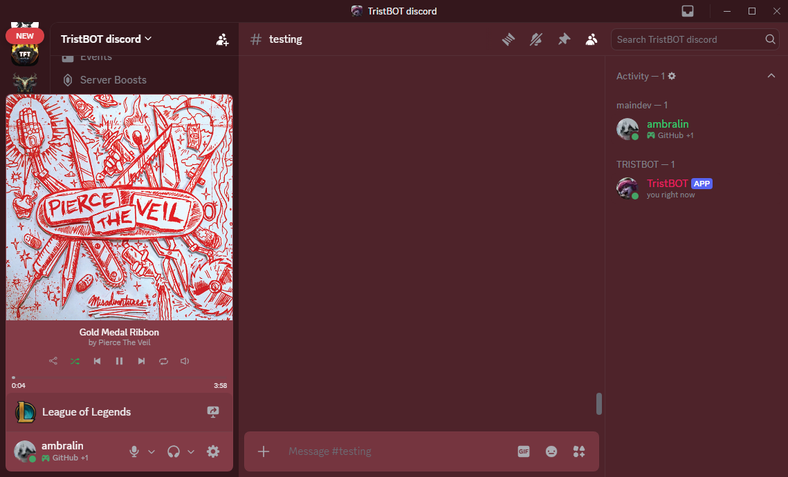
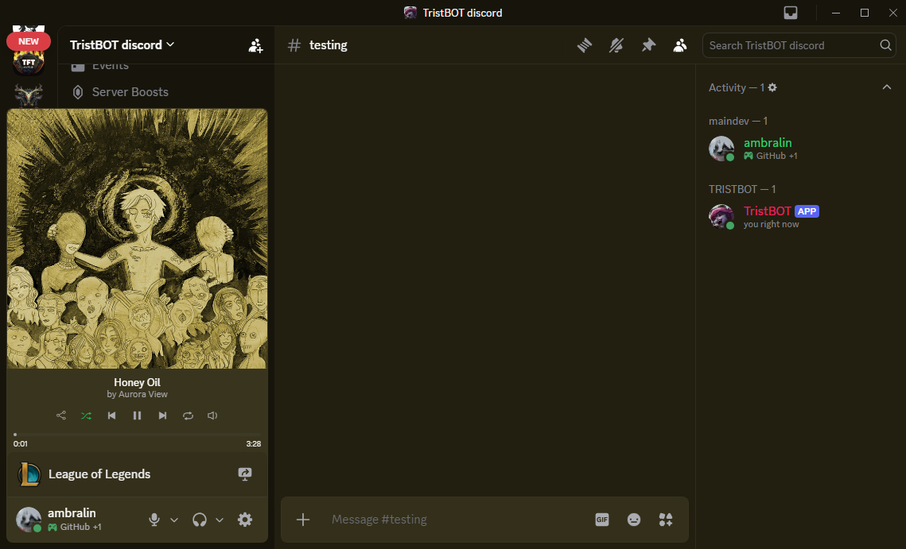
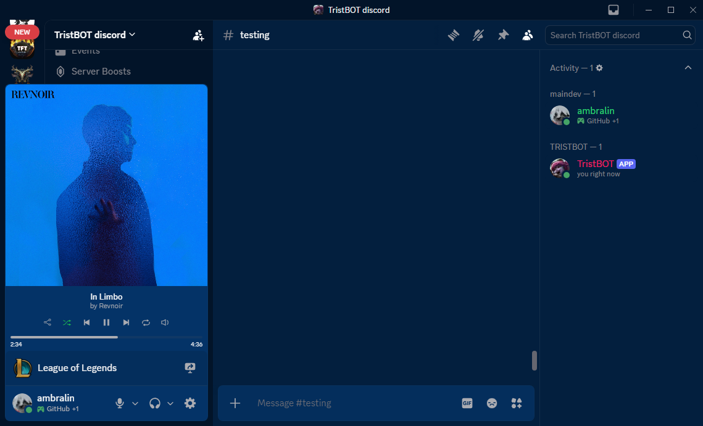

# MusicTheme BD-Plugin
a betterdiscord plugin which takes your current music presence and makes the discord client colors based on the song icon
for youtube music you need the premid browser extension

  
  

*This plugin is licensed under CC BY-NC 4.0 — free to use, not for resale.*
